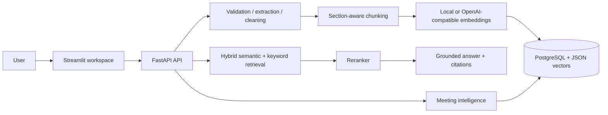

# Enterprise RAG & Meeting Intelligence Agent

A portfolio-ready, production-shaped RAG application for synthetic operational documents and meeting transcripts. It ingests PDF, DOCX, TXT, Markdown, and CSV files; combines semantic and keyword retrieval; returns citations; and exposes meeting decisions, risks, and action items through FastAPI and Streamlit.

> All included content is synthetic. Do not add client, confidential, credential, or proprietary data.

## Business problem
Operational knowledge is scattered across SOPs, incident reports, and meeting notes. This project makes that knowledge searchable while keeping answers grounded in retrieved evidence and exposing the source page, section, and chunk.

## Architecture


## RAG pipeline
Upload -> validate -> extract -> clean -> detect sections -> sentence-aware chunks -> metadata -> embeddings -> SQL-backed vector records. Queries use a 65/35 semantic/keyword blend, filename-aware reranking, a confidence gate, and a deterministic local grounded answerer. The architecture is ready for an OpenAI-compatible LLM by replacing the answer adapter without changing the API contract.

Section-aware chunking is the default because SOP headings and incident sections are meaningful retrieval boundaries. It falls back to sentence boundaries and uses overlap to preserve context.

## Agent tools
The agent routes questions to `search_documents`, `retrieve_document`, `search_meetings`, `get_action_items`, `search_incidents`, `compare_documents`, and `summarize_document`. Meeting and multi-hop questions still pass through the same evidence and citation contract.

## Meeting intelligence
Synthetic transcripts are parsed into summaries, decisions, action items, owners, deadlines, risks, dependencies, and questions. Structured meeting data is stored in PostgreSQL tables and exposed at `/api/v1/meetings` and `/api/v1/action-items`.

## Security posture
- Tenant ID is carried through document metadata and retrieval filters.
- Models include users, tenants, and ACL-ready document ownership fields.
- Document text is treated as untrusted data; common prompt-injection instructions are neutralized before indexing and again before answer composition.
- Secrets are environment variables and are never logged.
- Production deployments should add OAuth/OIDC, row-level security, malware scanning, encryption, rate limits, and a managed vector index.

## API
- `GET /health`
- `POST /api/v1/documents/upload` multipart upload
- `POST /api/v1/documents/index` indexing status
- `POST /api/v1/query` with `{ "question": "...", "agent": true }`
- `GET /api/v1/documents/{id}`
- `GET /api/v1/meetings`
- `GET /api/v1/action-items`

## Run locally
```powershell
cd enterprise-rag-agent
python -m venv .venv
.\.venv\Scripts\Activate.ps1
pip install -r requirements.txt
$env:PYTHONPATH = (Get-Location).Path
python scripts/seed.py
uvicorn app.main:app --reload
```
Open `http://localhost:8000/docs`. In a second terminal: `streamlit run streamlit_app/app.py` and open `http://localhost:8501`.

The default local database is SQLite for a zero-setup demo. Set `DATABASE_URL` to PostgreSQL for the production-shaped deployment.

## Docker
```powershell
docker compose up --build
```
API: `http://localhost:8000/docs`; UI: `http://localhost:8501`.

## Testing and evaluation
```powershell
$env:PYTHONPATH = (Get-Location).Path
pytest -q
python evaluation/run_evaluation.py
```
The evaluation set contains 40 questions covering retrieval, missing information, ambiguity, conflicts, outdated content, duplicates, long-context behavior, multi-hop questions, prompt injection, citations, and incident search. Metrics include grounded hit rate, citation rate, confidence, and latency; production evaluation should add labeled precision/recall, context relevance, answer correctness, citation correctness, groundedness, hallucination rate, and p95 latency.

## Screenshots
Add screenshots of the Ask, Documents, Meetings, and Action items views here after running the local UI.

## Limitations and future improvements
The fallback answerer is intentionally deterministic and is not a substitute for a hosted LLM. Current embeddings are local hashed vectors and vectors are stored in JSON for portability. Next improvements: pgvector/FAISS, cross-encoder reranking, OIDC and row-level ACL enforcement, OCR, async indexing, LLM structured outputs, richer multi-hop orchestration, and automated regression dashboards.

## GitHub publishing
```powershell
git init
git add .
git commit -m "Build enterprise RAG meeting intelligence agent"
git branch -M main
git remote add origin https://github.com/<your-user>/enterprise-rag-agent.git
git push -u origin main
```

## Resume bullets
- Built a FastAPI and Streamlit enterprise RAG assistant with hybrid retrieval, reranking, grounded citations, confidence gating, and PostgreSQL-backed document metadata.
- Implemented meeting intelligence extraction for decisions, risks, dependencies, owners, deadlines, and action-item dashboards.
- Added prompt-injection defense, tenant-aware retrieval, Docker deployment, synthetic evaluation data, and automated pytest coverage.

## 60-second interview explanation
I built a grounded knowledge assistant for SOPs, incident reports, and meetings. Documents flow through validation, extraction, section-aware chunking, metadata enrichment, and embeddings. At query time I combine semantic and keyword retrieval, rerank candidates, apply a confidence threshold, and return an evidence-first answer with document, page, section, and chunk citations. Meeting transcripts are also parsed into relational decision and action-item records. The project runs in a deterministic local mode, while the same API boundary supports an OpenAI-compatible model in production. Security treats documents as untrusted, filters by tenant, and keeps secrets out of logs.

## System-design discussion
The API layer is stateless and can scale horizontally. PostgreSQL stores authoritative metadata, meeting entities, ACL-ready tenant fields, and chunks; a production deployment can move embeddings to pgvector or FAISS. Indexing should be asynchronous behind a queue for large files. Retrieval is observable through request IDs, latency, scores, and citations. LLM calls should use timeouts, retries with budgets, structured output validation, and fallback responses. Tenant filtering must happen before retrieval and again before response assembly.

## Interview questions and answers
**Why hybrid retrieval?** Keyword retrieval preserves exact incident IDs and error terms while embeddings handle paraphrases; blending improves recall.

**How do you prevent hallucinations?** Require evidence, gate low scores, constrain the answer prompt to evidence, validate citations, and return an explicit no-evidence response.

**How would you scale it?** Async ingestion, object storage, a queue, pgvector or a managed vector store, cached embeddings, horizontal API replicas, and measured p95 latency.

**How do you handle conflicting documents?** Retrieve both, expose timestamps and versions, label the conflict, and ask for clarification rather than silently choosing.

**What belongs in production hardening?** OIDC, row-level security, malware scanning, encryption, audit logs, rate limits, secret management, PII redaction, and adversarial evaluation.
